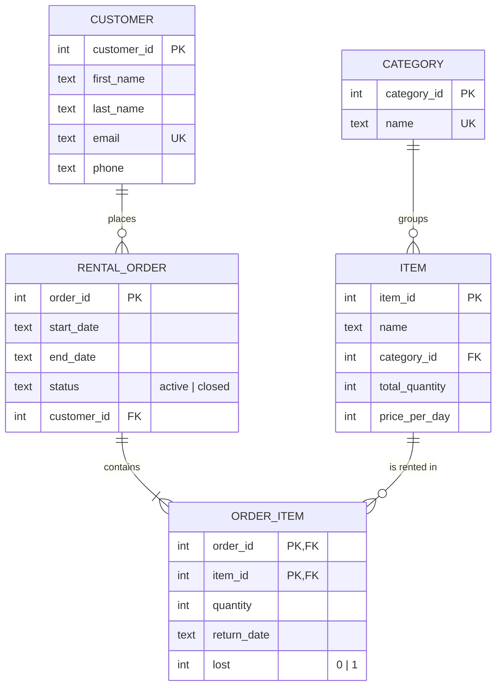

# CityBike Hub – Rental Database System

A relational database and Python application for a small bike and equipment rental business. Built as a course project in **EBA3420 Databases** at BI Norwegian Business School (fall 2025), then cleaned up and extended afterwards.

**Skills shown:** ER modelling · normalisation (3NF) · SQL (DDL, joins, aggregation, constraints) · SQLite · Python · pandas · matplotlib · unit testing with pytest

---

## The problem

CityBike Hub rents out bikes, scooters and safety equipment. The business needs to:

- know which items are in stock right now
- let customers borrow and return items, grouped into rental orders
- track returns and lost items per order
- produce a receipt when an order is closed
- see which product categories bring in the most revenue

## Data model



**Design choices**

- `OrderItem` resolves the many-to-many relationship between orders and items, with a composite primary key `(order_id, item_id)`.
- **Available stock is calculated, not stored:** `total_quantity − units on loan − units lost`. Storing it would create a second source of truth that could drift out of sync.
- `CHECK` constraints protect data quality at the database level (for example `status IN ('active','closed')`, `quantity > 0`, `end_date >= start_date`).
- All tables are in **third normal form**: every non-key attribute depends only on its table's key.

## How it works

```
python rental.py --reset     # build citybike.db from schema.sql + seed.sql
python rental.py             # start the rental program
```

Example session:

```
Enter customer ID: 1
Welcome, Ola Nordmann!
No active rental order.

1 - Borrow  2 - Return  3 - Exit
Choice: 1
  1: City Bike 16" (vehicle) – 5 available – 100 NOK/day
  ...
Borrowed 2 × item 1 (order 6).

Choice: 2
Item ID to return: 1
All items returned – order closed.

===== RENTAL RECEIPT =====
Customer: Ola Nordmann
Period:   2025-12-01 to 2025-12-04 (3 days)
- City Bike 16": 2 × 100 NOK × 3 days = 600 NOK
TOTAL: 600 NOK
```

## Analysis: revenue by category

[`analysis.ipynb`](analysis.ipynb) queries the database with SQL, loads the result into pandas and visualises it.


Vehicles account for about 80 % of revenue. The notebook also shows that ignoring rental length would understate revenue by roughly two thirds, because multi-day rentals are where most of the money is.

## Project structure

```
├── schema.sql          # CREATE TABLE statements (drops and recreates tables)
├── seed.sql            # fictional sample data
├── rental.py           # business logic + command-line interface
├── analysis.ipynb      # revenue analysis with pandas and matplotlib
├── tests/              # pytest unit tests
└── images/
```

## Run it yourself

```bash
pip install -r requirements.txt
python rental.py --reset
python rental.py
pytest            # run the tests
```

## What I improved after the course

The first version worked, but reviewing it later I found several issues, which I fixed:

| Issue | Fix |
|---|---|
| Revenue analysis ignored rental length (a 5-day rental counted as 1 day) | Revenue now uses quantity × price × days, the same as the receipt |
| SQLite doesn't enforce foreign keys by default | Every connection runs `PRAGMA foreign_keys = ON`; a test checks it |
| Returning an item that wasn't in the order still printed "returned" | The program checks `rowcount` and shows an error |
| Borrowing an item again after returning it counted returned units as on loan | Not allowed within the same order |
| `lost` column existed but was never used | Lost items can be reported, reduce stock and are flagged on the receipt |
| Order IDs were generated with `MAX(id) + 1` | SQLite assigns IDs automatically |
| Logic and `input()` were mixed together | Logic is in plain functions, so it can be unit-tested |

## What I learned

<!-- Write this in your own words – 3–4 bullet points. For example:
- what was hardest in the ER model and why you chose the design you did
- why enforcing rules in the database (constraints) is safer than only in Python
- what the revenue bug taught you about checking numbers from two different places
-->
